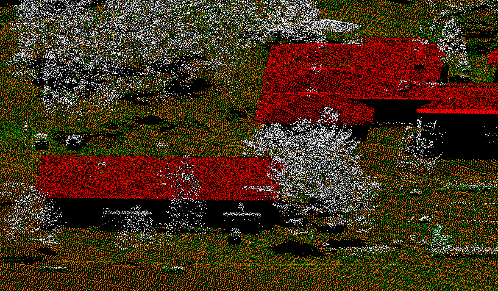
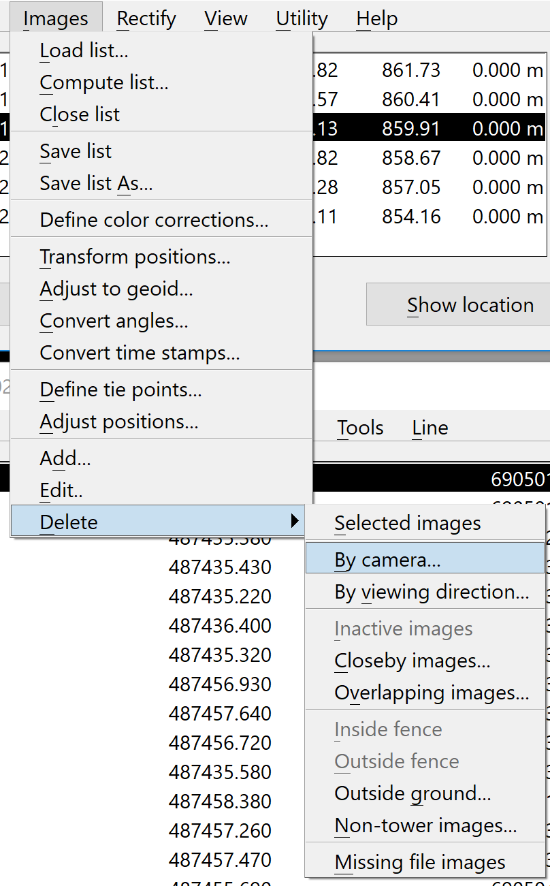
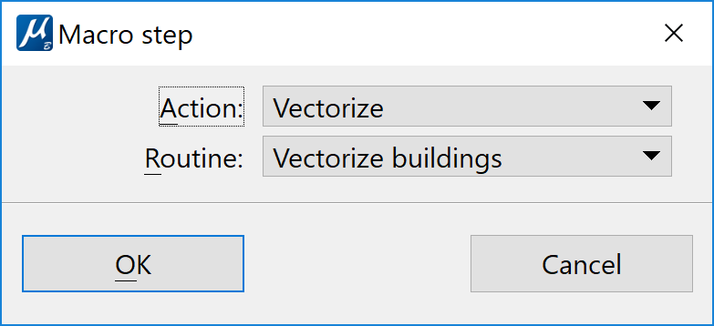
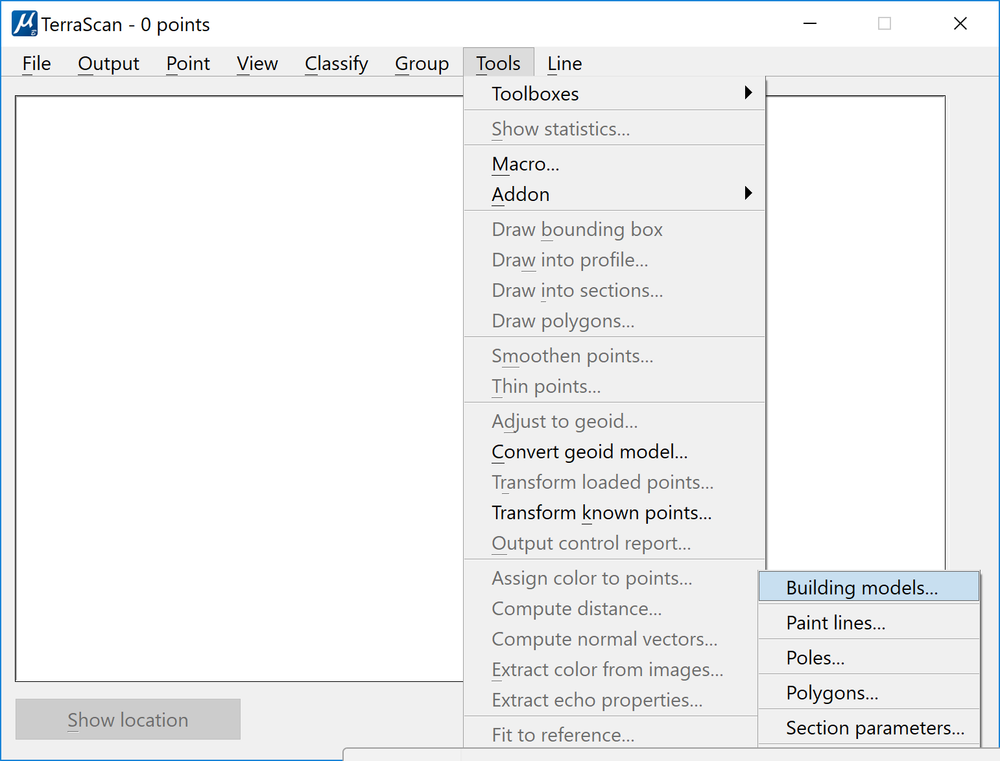

# Building Vectorization, Tree Mapping, and 3D City Model Visualization 

 
This training will help you to generate 3d vectorised buildings and animations starting from calibrated/oriented images and a calibrated pointcloud.

## Requierement 

We will use TerraScan and Terraphoto.
You need to have followed one of the basic trainings (ALS or MLS).

## Data set: Jyväskylä

Origin :
 * part of Jyväskylä city, laser data from 2011, images from 2012 
Included in the training folder :
 * laser data prepared (ground, building roofs classified)
 * class file
 * images from 5 cameras (vertical, oblique)
 * mission, adjusted image list , (true-)orthophotos 
 * dgn file

Overview of user interfaces :
  * main menu [TScan](http://www.terrasolid.com/guides/tphoto/mw.php), [TPhoto](http://www.terrasolid.com/guides/tscan/index.html?intromainwindowmenucommands.php)
  * main tool box [TScan](http://www.terrasolid.com/guides/tscan/intromaintoolbox.php)
  * general tool box [TPhoto](http://www.terrasolid.com/guides/tphoto/tboxgeneral.php), [TModeler](http://www.terrasolid.com/guides/tmodel/tbox_general.php), 

## Building vectorization (automatically/manual improvements) 

Our first big part consists in the buiding vectorization. Tscan offers tools to automaticly generate buildings from the pointcloud. A complete toolbox also offer us a way to adjust/complete this product. 

### Preparation

#### Pointcloud analysis

We open the dgn file in the `<training>/dgn` folder with microstation so that we can start.
If it is not loaded yet, load Terrascan with microstation `key-in` : `mdl load tscan`

We open the project using the [main tool box](http://www.terrasolid.com/guides/tscan/intromaintoolbox.php) in `<training>/dgn` folder and then one of its blocks. 

 

We can now play around with the data, checking its density, classification and noise level.

cut overlap not done → would be better to do to reduce noise level and to avoid issues due to mismatch in data 
density with overlap ~23pts/m2, without overlap ~10pts/m2
10 pts/m2 are good for vectorizing buildings with major details on roofs, less density allows only vectorization of large buildings, more density improves result only marginally 

 ---
 _Note_ : 
 We can notice a first issue in the dataset. There is no point on dark roofs, vectorization will not be possible on them
 ---
 

The classification was done using the grouping tools. It isolates the roof details (as chimneys) in a different class.

 
We have now analysed our data, you can close the block.

#### Images preparation

For this part we will use Terraphoto. 
Once Terraphoto is loaded (key-in : `mdl load tphoto`), we open the mission file `<Trainin>/mission/jyvaskyla_midas.mis`.
We then load a point cloud as a DTM. We could have extracted model key points from our ground class but was done for use, just use the file `<Trainin>/laser03/key15.fbi` (main window menu : [Points/Import from file](http://www.terrasolid.com/guides/tphoto/mwloadfromfile.php).  
 

  
Some pararameters need to be checked in TerraPhoto settings:

 * [Memory usage > Image cache](http://www.terrasolid.com/guides/tphoto/setmemoryusage.php) set to `4000 MB` (64-bit version).
 

* [Builtin projection systems](http://www.terrasolid.com/guides/tphoto/setbuiltinprojectionsystems.php) with `Finnish ETRS GK26` on.

Now you can open the [image list](http://www.terrasolid.com/guides/tphoto/mwloadlist.php?) <training>/mission/image_hrp_adjusted.iml through the main window image menu.

##### Image inspection

The image list is now loaded. We will be able to look at the images, check their quality, their location and their orientation. 

To look at all the images, we use [Define color corrections](http://www.terrasolid.com/guides/tphoto/mwdefinecolorcorrections.php) available in the images menu.

The last number in image number indicates camera, e.g. 1=vertical cam, 2=backward-looking oblique cam, etc. You can also use the select by Camera tool.

##### Image filtering

Now that we are sure that our images are well in place. We will extract the list of the vertical camera images. Indeed, our tool for automatic vectorization only use them. To do so, we [delete the other camera images](http://www.terrasolid.com/guides/tphoto/mwdeletebycamera.php)from the list and save the new list under a new name. The tool is in the image menu.
 

We save the image list in the mission subfolder as `images_hrp_adjusted_vertical.iml`.

### Macro : automatic vectorization

#### Macro inspection

Our building vectorization will be done through a macro. It has been already prepared but let's go through its parameters to understand how it works. Open the <macro>/vectorize_buildings.mac file through the Tscan main window tool/macro menu.
 

The function used is [vectorize buildinga](http://www.terrasolid.com/guides/tscan/mavectorizebuildings.php). Edit it to access its parameters.

* user roof class: forces the vectorization of smaller details on roof represented by points in this class, ignores minimum detail setting (put to `none`)

* low classes: helps to place edges, use ground only if images are available, use ground and low vegetation if no images are available (`class 2, ground` here) 

* footprints can be used, only buildings with footprints are vectorized (`Do not use`)

* planarity: how well points must fit to the plane equation describing a roof plane, ~15 cm for “normal” ALS data, normally not smaller than 10 cm (here `0.12m`)

* increase tolerance: close-to-horizontal planes should be modeled as one roof plane, requires increase in planarity tolerance (here `0.25m`

* use images if available,  ~ 90% vectorization is then done from laser points and around 10% from images. The downside is that it prevents us to use tslave to launch the macro. You might want to tick it off on bigger project.

* output file : here will be defined all the generated polygons, the #bnumber make it possible to run the macro on every blocks wothout any overwriting one output by the other, value : `<yourfolder>\buildings\build_#bnumber.txt`.

#### Macro launch 

As this is a training, we will only work on block 33 for the following steps. We select it in TScan Project window and use the [run macro on project](http://www.terrasolid.com/guides/tscan/marunonproject.php) tool, `selected blocks only`, `200m` of neighbours, `Do not save points`. We do not save the points because we are not changing them, only generating an output file. As we ticked the use of images, we can not run in TSlave.

 #### Result analysis
 
If you open the text file in a text editor, you will notice that only the geometries are available. No level, colour or texture is associated with them. We will first associate some levels to different parts of our models when loading the vectors. To do so, we go to Tscan `settings/Building vectorization/levels`.

You should have roof, wall and base polygons specified on different levels.

As this setting is done, we can import the buildings. This is done through the [read/Building models](http://www.terrasolid.com/guides/tscan/mwreadbuildingmodels.php) tool in Terrascan main window.

random wall color 

look at models in design file with smooth rendering, a bit of lightning 

start Check building models tool 

unchecked buildings 

arrange views on 

check different views for building modification 

Check building models dialog → list of all (unchecked) models in dgn, largest buildings first in list 

View 1 → display of active (selected) model, wireframe rendering, rotated top view, good for understanding xy relationship of model, level with colored edges visible 

View 5 → rotated view, smooth rendering, good for 3D understanding of model, only level with active model should be visible 

View 7 → perspective/camera view, raw image displayed with lens distortion applied, viewer = camera position, displays best image for showing whole building (“overview”) 

View 8 → another camera view, displays image that is best for placing an edge or corner of the model (“detail view”), updated when a building modification tool is used to select an edge or corner 

start modification with easier buildings → scroll a bit down in list and select a simple building model 

check different modification tools from Building patches and Building edges tool sets 

see more info and example usage in the User Guide and the training animation 

Colored point cloud and textured vector models 

attach orthophotos as references in TPhoto 

Manage raster references, File > Attach directory, select ortho folder 

display in view 1 and Render view 

 

extract color for points from orthophotos 

activate color attribute for project 

TScan Project window Tools > Extract color from images 

all classes, extract from ortho images, footprint 1 pixel 

 

switch off display of orthos view 1 (keep R on for rendering), load laser points from all files of the project and display points by color to check result 

 

check TScan Settings > Point display > Depth separation, maybe change value to something big like 4.0 m, point cloud visualization gets less noisy 

 

close image list in TPhoto 

load list with all images (hrp_adjusted) 

delete images from vertical camera 

Images > Delete > By camera 

save list as images_hrp_adjusted_oblique.iml 

make all levels with vector models visible in dgn, all other levels invisible 

 

select vector models 

create wall textures 

Rectify > Rectify wall rasters 

minimum area 5 m210% coverage0.10 m pixel size 

format tiffdo not use depth maps 

output folder same as design file folder (dgn) 

prefix wall_modify element color on 

 

rotate view 1 

use TPhoto Render view tool, display rendered view with wall textures 

 

Display Rendering Settings tool 

Drape rasters on levels that contain roof polygons (e.g. 1,5) 

open Manage raster references tool, attach directory, folder with orthophotos, switch only R (render) on 

step was done before but wall texture creation seems to detach references 

use TPhoto Render view tool, display rendered view with orthos draped on roofs 

 

TerraModeler Surfaces tool, File > Import xyz binary file, select key15.fbi file from laser folder 

Default exclusion, Exclude outer triangles off 

name for surface model = key15, ok 

use Display raster triangles tool of TModeler to display surface model key15 on level 55 

display level 55 in view 1 

use TPhoto Render view tool, display rendered view with orthos draped on surface model 

 

open block 33 

display medium, high vegetation and pole classes, all other classes off 

trees best represented in point cloud, display true dimensions and shape for tree crowns 

use TPhoto Render view tool, display rendered view with points on trees and poles 

 

color from images not so good for smaller, espec. linear objects, constant or intensity colors better for visualization, constant color can highlight certain objects in point cloud 

open Display mode dialog, Color by intensity custom, Colors button 

save the intensity coloring scheme into a file 

cancel, close Display mode dialog 

 

 

assign intensity coloring to points in poles class 

Tools > Assign color, class poles, intensity coloring, select intensity color file 

use TPhoto Render view tool, display rendered view with points on trees and poles, check pole visualization 

 

save points 

Tree mapping for cities 

check cell library, attach ″karttali″ from terra installation folder 

check settings for tree species in TScan 

sample species birch and spruce 

use cells from the sample library 

draw fence around trees along a road 

Create tree cells 

one example species 

all points of a group inside fence 

select tree cells, Modify tree cells 

top, section, camera view 

use oblique images in camera view for detecting tree crown dimensions and trunk width 

select tree cells, Output tree cells 

write tree information into text file 

import for DB application 

Creation of a fly-through animation 

read all FBI files of the project, switch off time, line,... attributes, just keep attributes that are good for visualization (color, intensity) 

 

change active level to an empty level (e.g. 20) 

 

digitize a line string element that can serve as camera path for fly-over animation 

MS Place smart line tool, rounded corners 

use TModeler Set linear elevation tool and move line string to 300 m 

select element 

 

start Create fly-through movie tool in TPhoto 

back clipping 2500 m, front clipping 1 m 

render quality = High quality (for vector models and images draped on ground/roofs, lower quality for rendering only laser data, Capture if text needs to be included) 

video speed 25 frames/second, default speed = camera speed = 30-40 m/seconds for fly-overs 

change active level to empty level and color to other color 

Target > Create vectors 

to define the viewing direction of camera 

direction forward onto surface, step 50 m, distance 250 m, surface = key15, dz = 0 

open view 7, setup the view for recording frames of fly-over animation: 

view size (=frame size) 

view content (= frame content), e.g. level visibility (vector models, surface model triangles), point cloud display 

open TPhoto Define rendering settings > Enhance depth perception on, maybe sky background on 

check a few views with the preview option of the Create fly-through dialog, type frame number, click Preview, fix display if necessary 

create a few frames 

use e.g. Windows Movie Maker software to combine frames into a movie 
 
More information about this topic 

TScan Users Guide, Chapter 9: 3D Building Models http://www.terrasolid.com/download/user_guides.php) 

Training animations: http://www.terrasolid.com/download/animations/deliverybpt.php 
