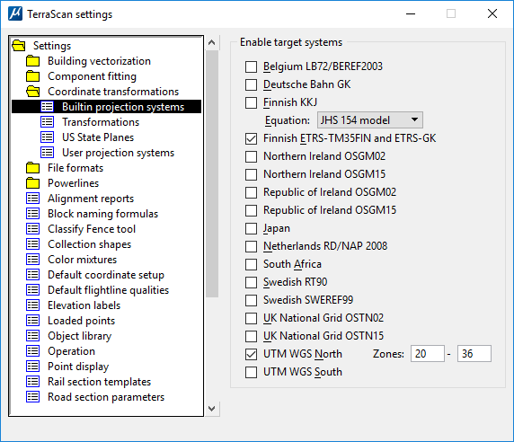

# Pole
#### 1. Laser data classification and grouping

test
==============

https://www.youtube.com/watch?v=JfvIN4HiM9s&feature=youtu.be&list=RDJfvIN4HiM9s&t=82

<dl>      
  <iframe id='test1' name='part1' width="1062" height="597" src="https://www.youtube.com/embed/CVNTzl544y0?start=225&end=268;rel=0&amp;showinfo=0" frameborder="0" allow="autoplay; encrypted-media" allowfullscreen></iframe>
    
 </dl>

.. raw:: html

    

        <iframe src="https://www.youtube.com/watch?v=JfvIN4HiM9s&feature=youtu.be&list=RDJfvIN4HiM9s&t=82 frameborder="0" allowfullscreen style="position: absolute; top: 0; left: 0; width: 100%; height: 100%;"></iframe>
    

test2
==============
https://youtu.be/2zjLBWnZGTU?t=115

#### 2. Definition of sample objects
#### 3. Creation of cell elements
#### 4. poles with the Find Poles tool

Basic Training TerraScan, TerraModeler, TerraPhoto, TerraMatch / 3 days
==============

#### Training data sets
##### 1. TerraScan, TerraMatch, TerraModeler, TerraPhoto → Jyväskylä ALS data set
		laser data: 21.5.2011, raw data in UTM 35 N, ″ellipsoidal″ heights,
		density about 23 points/m2
		images from other flight: 23.5.2012, altitude ca. 850 m, data in UTM 35 N
		trajectory information in text file,  coordinates in GK 26, orthometric heights
##### 2. ALS calibration → Calib data set
    Overview user interfaces
      • main menu TScan, TPhoto
      • main tool bar TScan, TPhoto, TModeler, TMatch
      
#### Boresight calibration of the scanner system (calibration data set)

    → separate training part with 'Calib' data set

Set up a project in TerraScan

Coordinate system settings and transformations

    • settings for coordinate systems
        * activate Finnish `ETRS-TM35GK and ETRS GK and UTM North zone 35`
    • define transformation
        * projection change, `UTM 35 → GK 26, modify: xyz`
	
Import trajectories
    • raw file formats, format definition in settings
    • set directory (trajectory/)
    • import raw file (trajectory_raw/)
        ◦ text file, format: time northing easting elevation roll pitch heading (TYXZRPH also implemented)
        ◦ angle = degree (depends on raw trajectory file), adjust heading on if transformation from lat/lon to projection system, thinning normally on (0.10 m/deg for airborne)
Cut or split turnarounds of trajectories
    • for matching and tscan processing tasks
    • several options to split trajectories automatically or manually
        ◦ draw polygon around project area, delete outside polygon
    • draw into design

Read points, display methods
    • read in a subset of points (every 10th, 50th, …)
        ◦ read at least time attribute, compare time stamps in laser data and trajectories, deduce using time, apply transformation
    • get familiar with data set, introduce display options, section views
Place project blocks
    • rectangular blocks or design block boundaries
    • draw lines on level 9 (use project boundary as outer boundary for blocks)
    • design block boundaries
        ◦ Bounding line work
        ◦ Line level: 1	Shape level: 10	Label level: 11
        ◦ Loaded every: 10th point
        ◦ Min count: 20	Max count: 40
Create a project
    • load class file (jyvaskyla.ptc)
    • storage format and attributes
        ◦ FBI		time: seconds-of-week		scanner, angle off
        ◦ load class file automatically, load trajectories automatically
    • add block boundaries, redraw boundaries with unique end of name as label
    • import points into project
        ◦ transform UTM 35 → GK 26
        ◦ deduce using time
Adjust elevation with a geoid model
    • open a block, compare laser data and control points (drawn in dgn on level 15)
    • adjust to geoid command from project window
        ◦ points from file: dgn/egm2008_geoid.txt (global geoid model)
    • often national model required to adjust from ellipsoidal heights to national height system
Boresight calibration and flight line matching (project data)
Preparing the data
    • open macro macro/01_prepare_match.mac, check settings
        ◦ inside shapes, level 12 (water boundaries)
        ◦ classify low points, ground, high vegetation, building roofs
        ◦ process flightlines separately: on
    • run macro on project (in TSlave)
        ◦ neighbours: 200 m 
        ◦ save points: write over original
    • visualize differences between flightlines
        ◦ compute distance method line average Z, class ground and building
        ◦ display points by distance, min/max: 0.10 m for ground and building class
Tie line measurement
    • define tie lines
        ◦ top view: 5 m	entry view: 2	detail view: 3	helping lines: 3 m
        ◦ laser time gap: 10 s	max error xy: 0.3 m	max error z: 0.5 m	fit tolerance: 0.12 m
        ◦ ground class: 2	trajectories: trj folder active in TScan
    • search tie lines
        ◦ use project points: laser01/training.prj		ignore first/intermediate
        ◦ spacing: 10 m	find surface lines	direction: slope direction
        ◦ length: 3 m		depth: 1 m		max angle: 1 deg
    • change tie line settings
        ◦ ground class: 6
    • search tie lines
        ◦ spacing: 5 m	find flat ground	direction: along movement	
        ◦ length: 3 m		depth: 1 m		max angle: 1 deg
    • find worse and delete bad tie lines
        ◦ some lines are placed on different roof levels → delete these tie lines
    • find, check tie lines with find next (just a few)
        ◦ elevation dz > 0.10m
    • save tie lines in tielines.til
