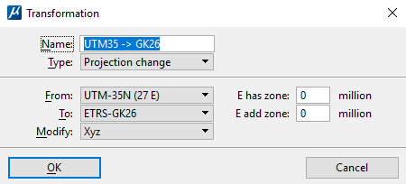
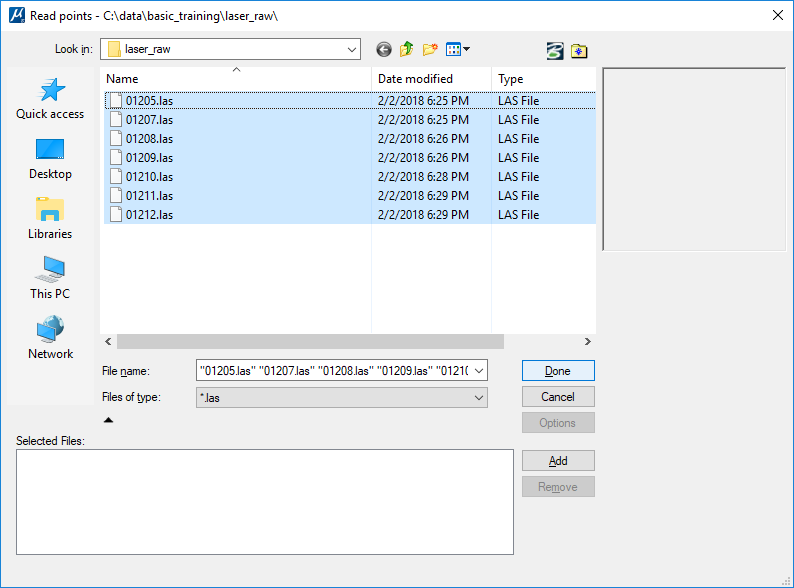
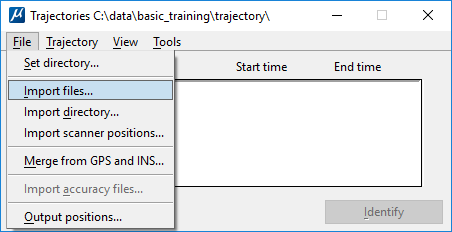
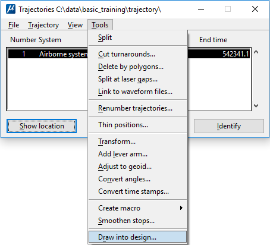
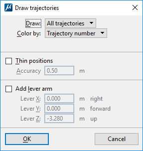
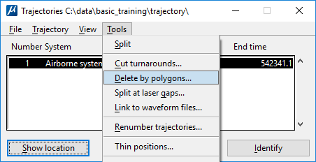

Basic Training for ALS Data producers, Bundle : TerraScan, TerraModeler, TerraPhoto, TerraMatch / 3 days
==============

In this training project, we will consider you as a aerial lidar data producer. We will go through all steps from boresight calibration to end products using 4 of our products : TerraScan, TerraModeler, TerraPhoto, TerraMatch.

#### Training data sets

##### 1.  Jyväskylä ALS data set
* laser data: 21.5.2011, raw data in UTM 35 N, 'ellipsoidal' heights,
* density about 23 points/m2
* images from other flight: 23.5.2012, altitude ca. 850 m, data in UTM 35 N
* trajectory information in text file,  coordinates in GK 26, orthometric heights
##### 2. ALS calibration : Calib data set
Overview user interfaces
  * main menu TScan, TPhoto
  * main tool bar TScan, TPhoto, TModeler, TMatch   

##### Set up a project in TerraScan

The first step for every process in TerraScan consist in setting the coordinate system. As trajectories and/or end product might be in different coordinate systems, we will show you how to activate a coordinate system and how to set a transformation. 

###### Coordinate system settings and transformations
  * settings for coordinate systems
     * activate Finnish `ETRS-TM35GK and ETRS GK and UTM North zone 35`
     
  
  
   
  
  * define transformation
     * projection change, `UTM 35 → GK 26, modify: xyz`
     

###### Read a subset of points

Your coordinate system being set, it is time to visualize and get familiar with your raw data.

 * In the main menu, go to `File/Read points`

* Be sure to select the right transformation we defined earlier and the subset factor (here 1 out of 10 points is read)

##### Import trajectories

A lot of TerraScan and TerraMatch tools, specialy during the matching process, need the flight trajectories.

* raw file formats, format definition in settings
* set directory (trajectory/)
   
   

   * import raw file (trajectory_raw/)
      * text file, format: time northing easting elevation roll pitch heading (TYXZRPH also implemented)
      * angle = degree (depends on raw trajectory file), adjust heading on if transformation from lat/lon to projection system, thinning normally on (`0.10 m/deg for airborne`)
      
      
      
##### Cut or split turnarounds of trajectories
   * For matching and tscan processing tasks
   
      * Draw into design allow us to visualize the trajectories by creating lines in the active level
      
                 
             
        
                                                                   
   * Several options to split trajectories automatically or manually, here we will use a polygon
      
      * Draw polygon around project area
      
      * Select the polygon
      
     
     
      * Pick delete outside polygon
      
         
        
     

      
   * To check that the split when right and that the trajectories and points timestamps are coherent, we will deduce from which trajectory points come based on the timestamps. For this, on the main bar, go to `Line/Deduce using time`

       

#### Boresight calibration of the scanner system (calibration data set)
* separate training part with 'Calib' data set

