Basic Training for ALS Data producers, Bundle : TerraScan, TerraModeler, TerraPhoto, TerraMatch / 3 days
==============

In this training project, we will consider you as an aerial lidar data producer. We will go through all steps from boresight calibration to end products using 4 of our products : TerraScan, TerraModeler, TerraPhoto, TerraMatch.

## Training data sets

### 1.  Jyväskylä ALS data set
* laser data: 21.5.2011, raw data in UTM 35 N, 'ellipsoidal' heights,
* density about 23 points/m2
* images from other flight: 23.5.2012, altitude ca. 850 m, data in UTM 35 N
* trajectory information in text file,  coordinates in GK 26, orthometric heights
### 2. ALS calibration : Calib data set
Overview user interfaces
  * main menu TScan, TPhoto
  * main tool bar TScan, TPhoto, TModeler, TMatch
### 3. Project additionnal documents
* Project DGN file based on a 3d mm seed file, contains project limit, 2d objects and level definition
* Point class definition file

## Set up a project in TerraScan

The project in Terrascan is a metadata file allowing you to associate locations to your data, your trajectories etc.. and some other parameters so that that can be saved, transfered, reloaded and documented more easily.
As soon as you start to work properly in a production project, it should be defined. 

A project requires most of the time to set 5 elements :
 1. Coordinate System settings
 2. Raw data
 3. Trajectories
 4. Blocks
 5. Point class
 
 We will first prepare all these settings on a test subset of points before formally defining the project.
 
 --- 
 _Note :_
 Some of them can use the default parameters or be ignored on a particular small project 
---

Open the DGN file in `<trainingFolder>/dgn` via microstation so that we can start.

### Project preparation

#### Coordinate system settings and transformations

The first step for every process in TerraScan consists in setting the coordinate system. As trajectories and/or end product might be in different coordinate systems, we will show you how to activate a coordinate system and how to set a transformation. 

  * settings for coordinate systems
     * activate Finnish `ETRS-TM35GK and ETRS GK and UTM North zone 35`
     
  
  
   
  
  * define transformation
     * projection change, `UTM 35 → GK 26, modify: xyz`
     
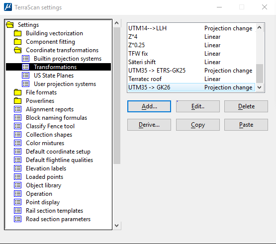

##### Read a subset of points

Your coordinate system being set, it is time to visualize and get familiar with your raw data.

 * In the main menu, go to `File/Read points`

* Be sure to select the right transformation we defined earlier and the subset factor (here 1 out of 10 points is read)

#### Trajectories

A lot of TerraScan and TerraMatch tools, specialy during the matching process, need the flight trajectories.

##### Import Trajectories

* raw file formats, format definition in settings
* set directory (trajectory/)
   
   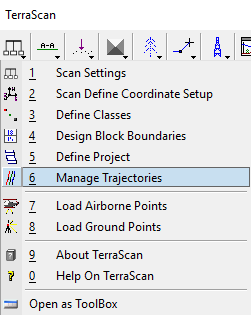

   * import raw file (trajectory_raw/)
      * text file, format: time northing easting elevation roll pitch heading (TYXZRPH also implemented)
      * angle = degree (depends on raw trajectory file), adjust heading on if transformation from lat/lon to projection system, thinning normally on (`0.10 m/deg for airborne`)
      
      
      
##### Cut or split turnarounds of trajectories
   * For matching and tscan processing tasks
   
      * Draw into design allow us to visualize the trajectories by creating lines in the active level
      
                 
             
        
                                                                   
   * Several options to split trajectories automatically or manually, here we will use a polygon
      
      1. Draw polygon around project area
      
      2. Select the polygon
      
     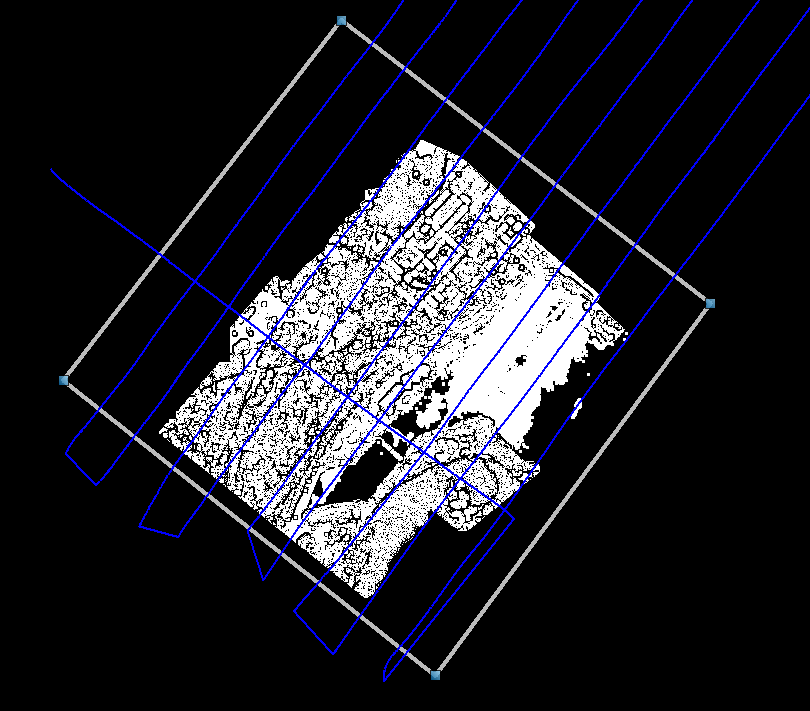
     
      3. Pick delete outside polygon
      
         
        
     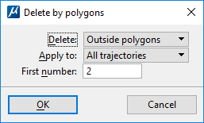

      
   * To check that the split when right and that the trajectories and points timestamps are coherent, we will deduce from which trajectory points come based on the timestamps. 
   
     1. For this, on the main bar, go to `Line/Deduce using time`

     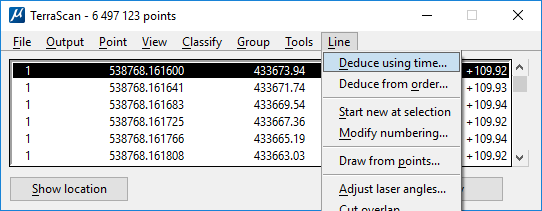  

     2. Then we will display the points based on their trajectories
     
   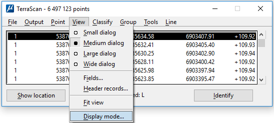  
    
    
   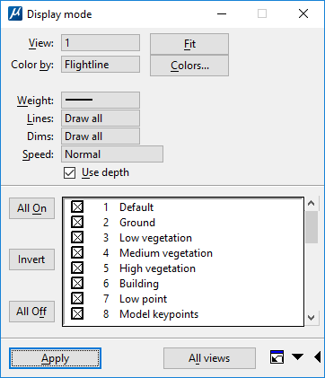
    
   
   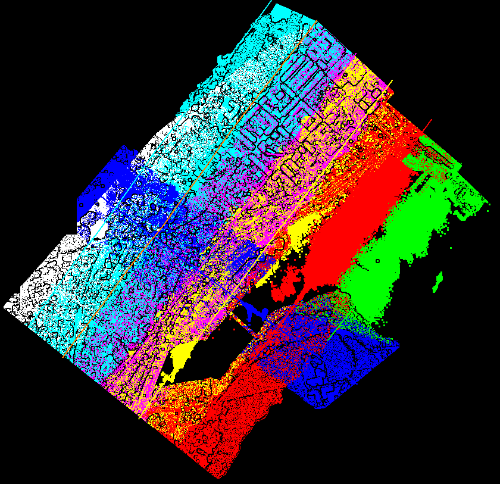     
    
 * At this stage, you can get familiar with the data through the section and display tools.
 
       
    
 ---
 _Warning_ : 
 For the section tool, please follow the instruction on the bottom left of your screen.
 ---
 
 ---
 _Note_ :
 Our subset is ready and you checked that the trajectories are well related.
 ---
 
 #### Block Limit Definition
 
To work properly, we will devide our project area into different blocks. It will allow to test in one block and then execute processes on every blocks independently. That way if an error arises on a specific block, it will not impact the others. The number of points in memory at a time will also be lower.

There are different ways to design blocks, here we will draw lines dividing our project area shape in three parts.

* To create these lines, active the level 9 and use microstation smart line tool

 
 
    

 * Once the lines created, we pick the `Design Block Boundaries`
 
 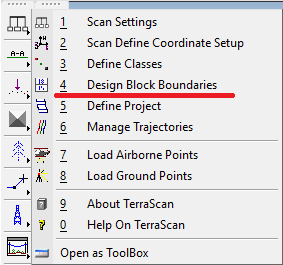
 
  * `Line level` contains user defined block division
  * blocks will be drawn to `Shape level`
  * number of points inside blocks will be drawn to `Label level`
  
   
 
 * If the precedent levels are active, you should be able to see the result
  
    
  
  #### Point Class definition
  
In Terrascan, you can create and save your own point class files. Here we will load an existing one:
`<trainingFolder>/classes.ptc`
 
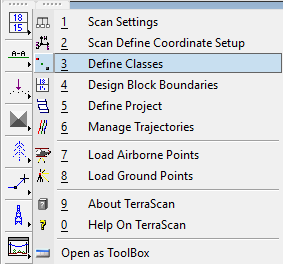  

 
 ---
 _Note_ : 
 We now have trajectories, points, blocks, and point classes checked. We will be able to formally define the project
 ---
 
### Project Formal Definition

The project related tools can be found in the main tool bar.

  

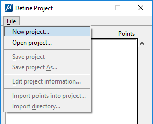

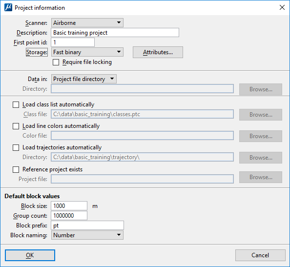

Here you have to select the attributes you want to be saved with your project. If you do not pick Color and then add color to your points, then the color will be lost after saving and closing the project.

 
 ---
 _Warning_ : 
 The storage format is here really important. Only the `Fast Binary` default one support all the attributes!
 ---
 
 You can chose the location of different important project folders. For your first project, the closer to the default parameter would be the better.
 
 For the block size. We went through the block definition earlier so we will not use these default parameters, you can let them as they are.
 
 #### Saving the project
 
 As the project definition is done, we will save it. This has to be done after every big step.
 
 

 ---
 _Note_ : 
 You can save the project anywhere but, as by default the data will be saved in the same folder, we prefer to use a folder name like Laser01, the number referring to your project step.
 ---

 
#### Creating the Blocks

The block limits have already be drawn, we just need to select them and to declare them as the project blocks

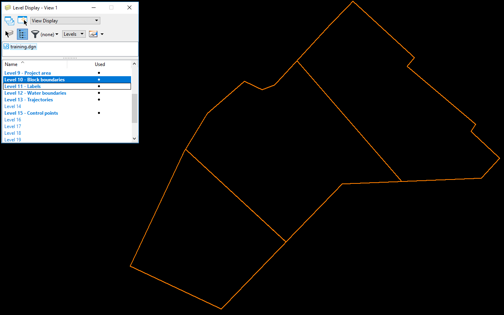

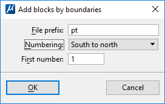

To check that it went well, use the project tool to draw them onto the dgn.

#### Points import

### Boresight calibration of the scanner system (calibration data set)
* separate training part with 'Calib' data set

